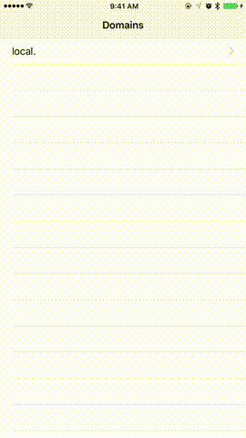

DuoKit
======

DuoKit, a free and open-source IoT control solution for **Arduino Yún** a-likes based on Bonjour.



**Feature**

- Free and open source.
- Discover local devices with Bonjour, IP addresses are not required.
- Pre-defined UI layout within your Arduino sketch.
- Auto reload values within given time.
- User defined controls are are also available.

Install
-------

*As this library requires much of flash memory, it's recommanded to use an Arduino Mega 2560 R3 or Zero with a Yún Shield if your pre-existed sketch is large.*

**Arduino Library:**

- In Arduino IDE, select `Sketch > Include Library > Add .ZIP Library`.
- Choose **DuoKit** folder within the `/lib/` folder of this repo.
- Restart Arduino IDE.

*Or simply create a symlink to the repo (e.g. macOS):*
```
ln -s lib/Arduino/DuoKit ~/Documents/Arduino/libraries/DuoKit
```

**For Arduino Yún:**

*Make sure you have firmware version v1.5.3 or higher to prevent network issues.*

- Set **REST API Access** to **Open** in WebUI on your Arduino Yún before using this example.
- SSH into your Arduino Yún via `ssh root@arduino.local`.
- Use the following command to add `_http._tcp` service to avahi-daemon:
```
wget --no-check-certificate -O /etc/avahi/services/duokit.service https://raw.githubusercontent.com/x43x61x69/DuoKit/master/misc/avahi-service/duokit.service
avahi-daemon --reload
```

*If you get `wget: can't execute 'openssl': No such file or directory` error:*
```
opkg update
opkg install wget ca-certificates
```

**For LinkIt 7688 Duo:**

*Make sure you have firmware version v0.9.4 or higher to prevent network issues.*

Enable Yun Bridge on LinkIt 7688 Duo before use this library:
```
uci set yunbridge.config.disabled='0'
uci commit
reboot
```

**For Other Arduino Yún Compatibles:**

*You may need to setup Avahi if you don't have it already:*
```
opkg update
opkg install dbus dbus-utils
opkg install avahi-daemon
opkg install avahi-dnsconfd avahi-utils
reboot
```

Usage
-----

The code will take a few seconds to finish initializing on boot. The built-in
LED will flash a few times, then stay on for a while until it flashes again
and then dims. You may then use the REST API to control the PINs:

- Read digital PIN 13: `/arduino/digital/13`
- Set digital PIN 13 to **HIGH**: `/arduino/digital/13/1`
- Read analog PIN 2: `/arduino/analog/2`
- Set PIN 13 mode to **INPUT**: `/arduino/mode/13/0`
- Set PIN 13 mode to **OUTPUT**: `/arduino/mode/13/1`
- Set PIN 13 mode to **INPUT_PULLUP**: `/arduino/mode/13/2`

You can also read/write pre-mapped variables via key name:

- Ping your device to see if it's ready: `/arduino/ping`
- Read value for key **MyAwesomeKey**: `/arduino/read/MyAwesomeKey`
- Update value for key **MyAwesomeKey**: `/arduino/update/MyAwesomeKey/123.45`
- List available keys (disabled by default): `/arduino/list`
- Remove value for key **MyAwesomeKey** (non-reversale, disabled by default): `/arduino/remove/MyAwesomeKey`

The feedback will be in **JSON** format, e.g.:

```
{"api":1,"status":"ok","pin":13,"value":0,"mode":1}
{"api":1,"status":"ok","key":"count","value":134.65}
```

Pre-defined UI layout is also possible via Arduino code. Check out the
**Example** code for detail.

Example
-------

**Arduino:**

- Arduino IDE 1.8.0 or above is required.
- See `File > Examples > DuoKit > Basic`.

**DuoKit Browser (iOS):**

- An exmple that utilizes Apple's Bonjour service to look for available LinkIt
 7688 Duo boards within LAN, then load the Basic-sketch-enabled ones with
 pre-defined UI settings.
- Xcode 8.0 or above is required.
- See `/src/Example/iOS/DuoKit Browser/DuoKit Browser.xcworkspace`.

License
-------

The MIT License (MIT)

Copyright © 2017 Zhi-Wei Cai. All rights reserved.

Permission is hereby granted, free of charge, to any person obtaining a copy
of this software and associated documentation files (the "Software"), to deal
in the Software without restriction, including without limitation the rights
to use, copy, modify, merge, publish, distribute, sublicense, and/or sell
copies of the Software, and to permit persons to whom the Software is
furnished to do so, subject to the following conditions:

The above copyright notice and this permission notice shall be included in all
copies or substantial portions of the Software.

THE SOFTWARE IS PROVIDED "AS IS", WITHOUT WARRANTY OF ANY KIND, EXPRESS OR
IMPLIED, INCLUDING BUT NOT LIMITED TO THE WARRANTIES OF MERCHANTABILITY,
FITNESS FOR A PARTICULAR PURPOSE AND NONINFRINGEMENT. IN NO EVENT SHALL THE
AUTHORS OR COPYRIGHT HOLDERS BE LIABLE FOR ANY CLAIM, DAMAGES OR OTHER
LIABILITY, WHETHER IN AN ACTION OF CONTRACT, TORT OR OTHERWISE, ARISING FROM,
OUT OF OR IN CONNECTION WITH THE SOFTWARE OR THE USE OR OTHER DEALINGS IN THE
SOFTWARE.
